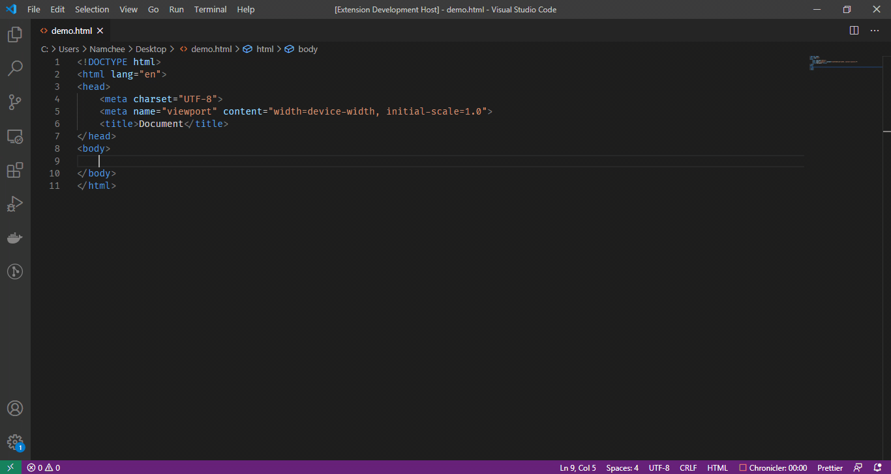

# Hyper Comment

Hyper Comment is a small code snippets to hypercharge Visual Studio Code when writing HTML comment.

## Language Support

- Normal HTML file (`*.html`)
- Vue HTML, which is any HTML code under `<template>` in Vue SFC file (requires [Vetur](https://marketplace.visualstudio.com/items?itemName=octref.vetur) to be installed)

## Features

- **Snippets**, just type `comment` on the supported languages and press `Enter` or `Tab` and this snippet
- **Conditional Commets**, you can add conditional comment by typing `if-comment`
will automatically create a leveled HTML comment.
- **Code surround-with**, you can highlight a block of text in the supported languages and press `Ctrl+Shift+,` to surround it with a leveled HTML comment.

## Motivation

Visual Studio Code provides us with great capabilities to easily write comments in most languages, especially in JavaScript. However, Visual Studio Code only provides barebone capabilities (only `<!-- -->` auto-completion) when it comes to writing comments in HTML (and on any language that embeds it).

This small extension enhances those capabilites by providing a leveled comment snippet with descriptive (enough) label.

Of course, you can use **HTML5 Semantics** or **id** or **class** to do this, but I think you can do better by providing your HTML code with useful comments.